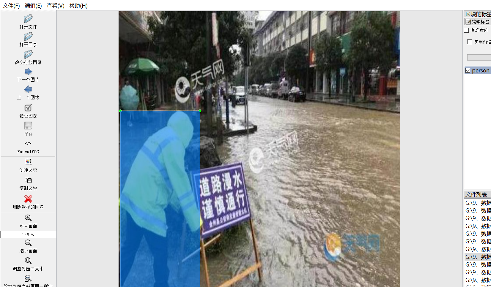
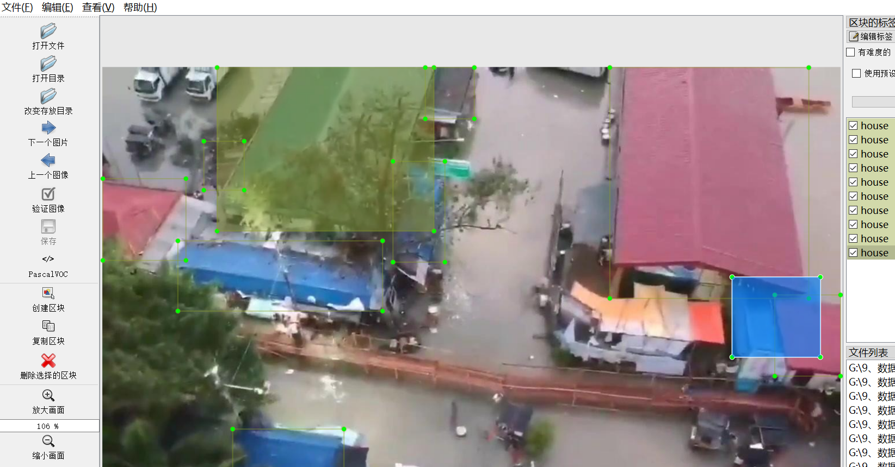

# [Dataset] Hong Water in Person Vehicle ROOM Detection Dataset YOLO-VOC 8680 images

The dataset introduction: The data set is a detection dataset of people, cars and houses in floods, with a total of 8680 images. It includes two annotation formats - Yolo and VOC, and all the images are clear without any enhancement.

Dataset Format: VOC format + YOLO format

The compressed file contains: three folders, each storing images, xml files, and text files.

Total jpg images in JPEGImages folder: 8680

The total number of XML files in the Annotations folder: 8680.

The total number of txt files in the labels folder is 8680.

Number of tag types: 3

Tag names: ["car","house","person"]

Number of boxes per label:

car frame count = 6480

house frame count = 10586

person frame count = 17849

Total boxes: 34915

Picture clarity (Resolution: Pixels): Clear

Is the image enhanced: No

Shape of the label: Rectangular box, used for object detection and recognition.

Important Note: None

Special Notice: This dataset does not guarantee the accuracy or precision of the trained models or weight files. The dataset only provides accurate and reasonable annotations.

## Images

---

Here is a pay link on Stripe (https://buy.stripe.com/3cs8yP7sY87d0vu9AB). Please contact me lonlonago@foxmail.com after funding $89, and I will send you a complete data files, thank you!

